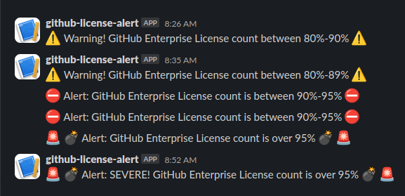

# GitHub Enterprise License Alert

This code is to be set up as a cron job to check your GitHub enterprise license status.
If your too close to the max, an alert will be triggered.  There are currently 3 thresholds:

1. Between 80-89% triggers and shows a warning
2. Between 90-95% triggers and shows an alert
3. Anything greater than 95% triggers and shows a severe alert

It will look a little something like so, but is completely customizable:

